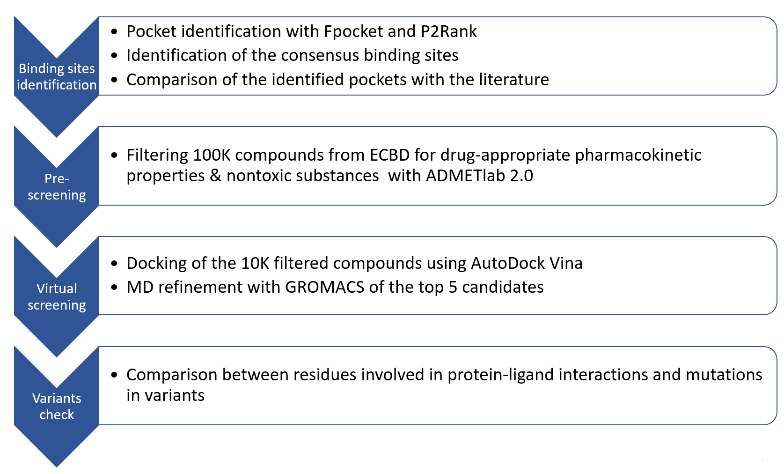

# EUROPEAN BIOINFORMATICS MASTERS NETWORK
# Meet-EU Course 2022/2023
# Prediction of potential inhibitors for the Sars-CoV-2 Helicase (Nsp13) by virtual screening and MD simulations
### Supervised by PD Dr. Carl Herrmann, Dr. Gurdeep Singh, Magdalena Georgieva

## Description 
This repository contains code and results for the virtual screening campaign of the European Chemical Biology Database (ECBD) followed up by MD simulations to predict potential NSP13 helicase inhibitors. Results of this study may act as a starting point for anti-viral drug development targeting NSP13.

## Workflow

## Contents of the folders:

* **Nsp13Structures**: provided NSP13 structures, saved as separated chains
* **pocket_detection**: output of Fpocket and P2Rank softwares for binding sites detection and results comparison, final pockets (**Final detexted binding pockets.pdf**), scripts for visualization in PyMOL
* **substances**: csv files of the full and filteres ECBD 
* **docking**: docking results obtained with AutoDock Vina 
* **md-simulations**: molecular dynamics results. Due to their large size trajectories and other files are only available on request.
* **src**: python scripts to run the analyses, when following instructions described below
* **env.yml** file is the Python enviroment file

## Instructions 
Structures used for the study: [7NIO](https://www.rcsb.org/structure/7NIO) and [7NN0](https://www.rcsb.org/structure/7NN0)
### Binding sites identification
First, [P2Rank](https://github.com/rdk/p2rank) and [Fpocket](https://github.com/Discngine/fpocket) were used to predict the binding sites for both NSP13 structures. 
**overlay_pockets.py** script then can be run to calculate the overlay in the results from different softwares. **cluster_pockets.py** produces plots that assist manual merging of the overlayed results.
### Filtering database
[ECBD](https://ecbd.eu/) was used as a starting point and then was checked for toxicity and pharmacokinetic properties with [ADMETlab web tool](https://admetmesh.scbdd.com/). 
**substances_filter.py** script filters then the ADMETlab output based on acceptance of at least 3 out of 4 rules (Lipinski Rule, Pfizer Rule, GSK Rule and Golden Triangle Rule).
### Molecular Docking
**docking.py** script takes the list of ligand in form of SMILES and the .pdbqt file for protein and runs the docking with AutoDock Vina software, script has also the refinement option corresponding to the docking run with the higher exhaustiveness. Docking directly from SMILES strings is possible thanks to the [Meeko](https://www.blopig.com/blog/2022/08/meeko-docking-straight-from-smiles-string/) Python package.
**docking_postprocess.py** takes the docking output, filters and sorts the results. For easier post-processing the pipeline defined by the Snakemake file can be used.
### Molecular Dynamics simulations
**MD_simulation_workflow.ipynb** jupyter notebook describes step by step the whole protein and ligand preparation process, necessary .mdp files can be found in the MD folder
This process was based on the [GROMACS tutorial](http://www.mdtutorials.com/gmx/complex/index.html) by Justin A. Lemkul, Ph.D.
### Variant analysis
[List of variants](https://www.ncbi.nlm.nih.gov/sars-cov-2/) was downloaded. 
**get_mutations.py** script was used then to 
### Docking results analysis
**Docking_results_comparison.ipynb** includes analysis of our docking results and comparison of our results with results from Prague Team 2

